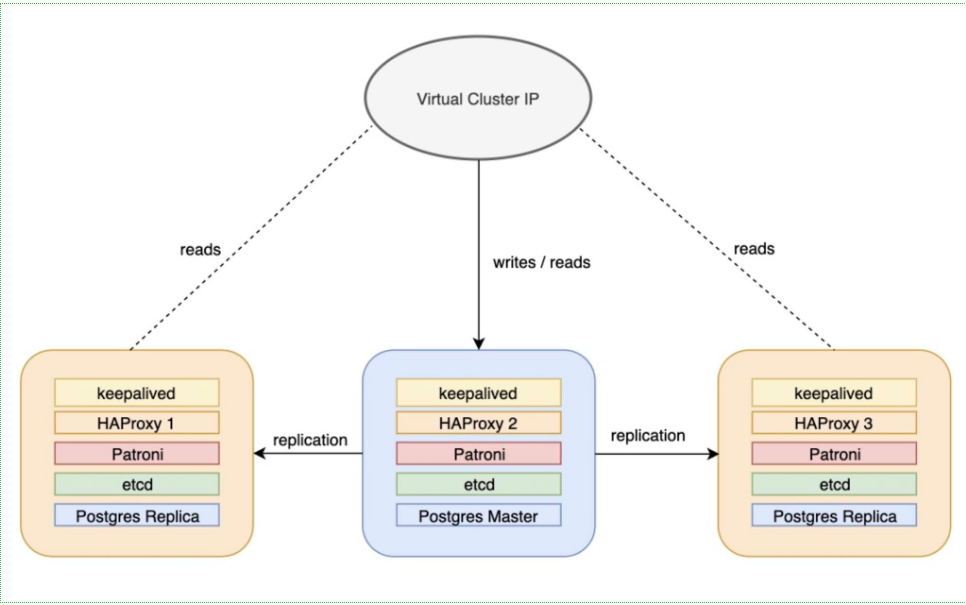

## Deloy on RedHat 9.2

### add hosts
    10.84.2.40 d-postgres-01
    10.84.2.43 vip
    10.84.2.41 d-postgres-02
    10.84.2.42 d-postgres-03

### install haproxy keepalived on all nodes

    yum install haproxy keepalived -y

### config keepalive

##### d-postgres-01 node

    # create new
    global_defs {
        # set hostname
        router_id LVS_DEVEL
    }
    
    vrrp_instance VRRP1 {
        # on primary node, specify [MASTER]
        # on backup node, specify [BACKUP]
        # if specified [BACKUP] + [nopreempt] on all nodes, automatic failback is disabled
        state MASTER
        # if you like disable automatic failback, set this value with [BACKUP]
        # nopreempt
        # network interface that virtual IP address is assigned
        interface ens192
        # set unique ID on each VRRP interface
        # on the a VRRP interface, set the same ID on all nodes
        virtual_router_id 101
        # set priority : [Master] > [BACKUP]
        priority 200
        # VRRP advertisement interval (sec)
        advert_int 1
        # virtual IP address
        virtual_ipaddress {
            10.84.2.43/24
        }
    }

#### d-postgres-02 node

    # create new
    global_defs {
        router_id LVS_DEVEL
    }
    
    vrrp_instance VRRP1 {
        state BACKUP
        # nopreempt
        interface ens192
        virtual_router_id 101
        priority 100
        advert_int 1
        virtual_ipaddress {
            10.84.2.43/24
        }
    }
#### d-postgres-03 node
    # create new

    global_defs {
        router_id LVS_DEVEL
    }
    
    vrrp_instance VRRP1 {
        state BACKUP
        # nopreempt
        interface ens192
        virtual_router_id 101
        priority 95
        advert_int 1
        virtual_ipaddress {
            10.84.2.43/24
        }
    }

    dnf install https://download.postgresql.org/pub/repos/yum/reporpms/EL-9-x86_64/pgdg-redhat-repo-latest.noarch.rpm -y
    
    dnf install postgresql16-server postgresql-contrib -y
    
    sudo ln -s /usr/pgsql-16/bin/* /usr/sbin

### ETCD install on all node

    ETCD_RELEASE=$(curl -s https://api.github.com/repos/etcd-io/etcd/releases/latest|grep tag_name | cut -d '"' -f 4)
    echo $ETCD_RELEASE
    wget https://github.com/etcd-io/etcd/releases/download/${ETCD_RELEASE}/etcd-${ETCD_RELEASE}-linux-amd64.tar.gz
    tar xvf etcd-${ETCD_RELEASE}-linux-amd64.tar.gz
    cd etcd-${ETCD_RELEASE}-linux-amd64
    mv etcd* /usr/local/bin 
    ls /usr/local/bin
    etcd --version
    etcdctl version
    etcdutl version
    mkdir -p /var/lib/etcd

    {
    NODE_IP="10.84.2.42"
    
    ETCD_NAME=$(hostname -s)
    
    ETCD1_IP="10.84.2.40"
    ETCD2_IP="10.84.2.41"
    ETCD3_IP="10.84.2.42"
    
    cat <<EOF >/etc/etcd/etcd.conf
    #[member]
    ETCD_NAME=${ETCD_NAME}
    ETCD_DATA_DIR="/var/lib/etcd/data"
    ETCD_LISTEN_PEER_URLS="http://${NODE_IP}:2380"
    ETCD_LISTEN_CLIENT_URLS="http://${NODE_IP}:2379,http://127.0.0.1:2379"
    #[cluster]
    ETCD_INITIAL_ADVERTISE_PEER_URLS="http://${NODE_IP}:2380"
    ETCD_ADVERTISE_CLIENT_URLS="http://${NODE_IP}:2379"
    ETCD_INITIAL_CLUSTER="d-postgres-01=http://${ETCD1_IP}:2380,d-postgres-02=http://${ETCD2_IP}:2380,d-postgres-03=http://${ETCD3_IP}:2380"
    ETCD_LOG_OUTPUTS="/var/log/etcd/etcd.log"
    ETCD_INITIAL_CLUSTER_TOKEN="etcd-cluster"
    ETCD_INITIAL_CLUSTER_STATE NEW
    ETCD_SNAPSHOT_COUNT="10000"
    ETCD_WAL_DIR="/var/lib/etcd/wal"
    ETCD_ENABLE_V2="true"
    
    EOF
    }

    cat <<EOF >/etc/systemd/system/etcd.service
    [Unit]
    Description=etcd key-value store
    Documentation=https://github.com/etcd-io/etcd
    After=network.target
    
    [Service]
    Type=notify
    EnvironmentFile=/etc/etcd/etcd.conf
    ExecStart=/usr/local/sbin/etcd
    Restart=always
    RestartSec=10s
    LimitNOFILE=40000
    
    [Install]
    WantedBy=multi-user.target
    
    EOF

#### check etcd
    etcdctl \
      member list \
      -w=table
    
    
    etcdctl  endpoint --cluster status -w table

### Install patroni on node1,node2,node3

    yum install python3-devel python3-pip libpq-devel
    
    
    pip3 install --proxy http://10.86.102.94:3128 --upgrade pip
    pip install --proxy http://10.86.102.94:3128 wheel
    pip install --proxy http://10.86.102.94:3128 patroni
    pip install --proxy http://10.86.102.94:3128 python-etcd
    pip install --proxy http://10.86.102.94:3128 psycopg2

#### patroni on all nodes

NOTE: Change ${NODE_NAME} and ${NODE_IP} the same infor on node

    mkdir -p /etc/patroni
    
    
    echo "
    namespace: percona_lab
    scope: cluster_1
    name: ${NODE_NAME}
    
    restapi:
        listen: 0.0.0.0:8008
        connect_address: ${NODE_IP}:8008
    
    etcd:
        host: ${NODE_IP}:2379
    
    bootstrap:
      # this section will be written into Etcd:/<namespace>/<scope>/config after initializing new cluster
      dcs:
          ttl: 30
          loop_wait: 10
          retry_timeout: 10
          maximum_lag_on_failover: 1048576
          slots:
            logicreplia:
                database: postgres
                plugin: pgoutput
                type: logical
          postgresql:
              use_pg_rewind: true
              use_slots: true
              parameters:
                  wal_level: replica
                  hot_standby: "on"
                  wal_keep_segments: 10
                  max_wal_senders: 5
                  max_replication_slots: 10
                  wal_log_hints: "on"
                  logging_collector: 'on'
    
      # some desired options for 'initdb'
      initdb: # Note: It needs to be a list (some options need values, others are switches)
          - encoding: UTF8
          - data-checksums
    
      pg_hba: # Add following lines to pg_hba.conf after running 'initdb'
          - host replication replicator 127.0.0.1/32 trust
          - host replication replicator   10.84.2.40/0   md5
          - host replication replicator   10.84.2.41/0   md5
          - host replication replicator   10.84.2.42/0   md5
          - host all all 0.0.0.0/0 md5
    
      # Some additional users which needs to be created after initializing new cluster
      users:
          admin:
              password: qaz123
              options:
                  - createrole
                  - createdb
          percona:
              password: qaz123
              options:
                  - createrole
                  - createdb 
    
    postgresql:
        cluster_name: cluster_1
        listen: 0.0.0.0:5432
        connect_address: ${NODE_IP}:5432
        data_dir: /var/lib/pgsql/16/data/
        bin_dir: /usr/pgsql-16/bin
        pgpass: /tmp/pgpass
        authentication:
            replication:
                username: replicator
                password: replPasswd
            superuser:
                username: postgres
                password: qaz123
        parameters:
            unix_socket_directories: "/var/run/postgresql/"
        create_replica_methods:
            - basebackup
        basebackup:
            checkpoint: 'fast'
    
    tags:
        nofailover: false
        noloadbalance: false
        clonefrom: false
        nosync: false
    " | sudo tee -a /etc/patroni/patroni.yml

#### Create patroni data directory on node1,node2 and node3:

    mkdir -p  /data/patroni
    chown postgres:postgres /data/patroni/
    chmod 700 /data/patroni/

#### Create systemd file for patroni on node1,node2,node3:

    vi  /etc/systemd/system/patroni.service
    
    
    
    [Unit]
    Description=Runners to orchestrate a high-availability PostgreSQL
    After=syslog.target network.target 
    
    [Service]
    Type=simple 
    
    User=postgres
    Group=postgres 
    
    # Start the patroni process
    ExecStart=/bin/patroni /etc/patroni/patroni.yml 
    
    # Send HUP to reload from patroni.yml
    ExecReload=/bin/kill -s HUP $MAINPID 
    
    # only kill the patroni process, not its children, so it will gracefully stop postgres
    KillMode=process 
    
    # Give a reasonable amount of time for the server to start up/shut down
    TimeoutSec=30 
    
    # Do not restart the service if it crashes, we want to manually inspect database on failure
    Restart=no 
    
    [Install]
    WantedBy=multi-user.target
    
    
    systemctl daemon-reload
    
    systemctl start patroni
    
    
    ln -s /usr/local/bin/patronictl /usr/local/sbin

#### check

    patronictl -c /etc/patroni/patroni.yml  list

#### config HAproxy on all node

    vi /etc/haproxy/haproxy.cfg
    # Add lines to this config
    
    global
          maxconn 100
           log 127.0.0.1:514  local0 info
    defaults
          log global
          mode tcp
          retries 2
          timeout client 30m
          timeout connect 4s
          timeout server 30m
          timeout   check   5s
    listen stats
          mode http
          bind *:7000
          stats enable
          stats uri /
    listen primary
          bind *:5000
          option httpchk /primary
          http-check expect status 200
          default-server inter 3s fall 3 rise 2 on-marked-down shutdown-sessions
          server d-postgres-01 10.84.2.40:5432 maxconn 100   check   port 8008
          server d-postgres-02 10.84.2.41:5432 maxconn 100   check   port 8008
          server d-postgres-03 10.84.2.42:5432 maxconn 100   check   port 8008

    listen standbys
        balance roundrobin
        bind *:5001
        option httpchk /replica 
        http-check expect status 200
        default-server inter 3s fall 3 rise 2 on-marked-down shutdown-sessions
          server d-postgres-01 10.84.2.40:5432 maxconn 100   check   port 8008
          server d-postgres-02 10.84.2.41:5432 maxconn 100   check   port 8008
          server d-postgres-03 10.84.2.42:5432 maxconn 100   check   port 8008