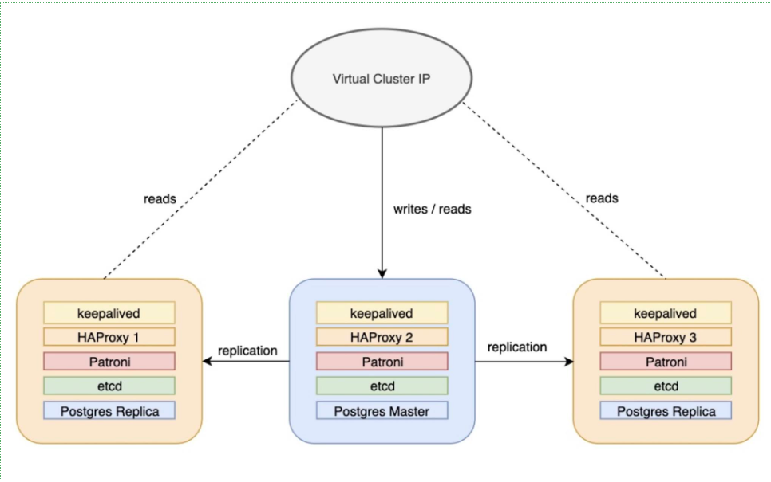
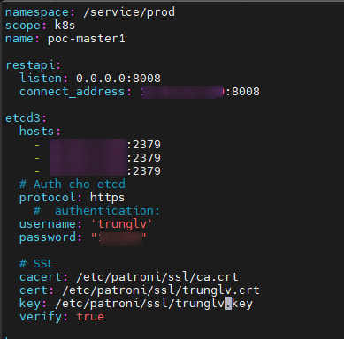

## Deloy on RedHat 9.2


### add hosts
    10.84.2.40 d-postgres-01
    10.84.2.43 vip
    10.84.2.41 d-postgres-02
    10.84.2.42 d-postgres-03

### install haproxy keepalived on all nodes

    yum install haproxy keepalived -y


### config keepalive

##### d-postgres-01 node

```
echo "
! Configuration File for keepalived

global_defs {
    router_id LVS_DEVEL
}


vrrp_script chk_haproxy {
    script "/etc/keepalived/check_haproxy.sh"
    interval 2
    weight -110
    timeout 5
    fall 3
    rise 2
}

vrrp_instance VI_1 {
    state MASTER
    interface ens192
    virtual_router_id 68
    priority 200

    authentication {
        auth_type PASS
        auth_pass 22222222
    }

    virtual_ipaddress {
        x.x.x.x/24
    }

    track_script {
        chk_haproxy
    }
}
" | sudo tee -a /etc/keepalived/keepalived.conf

echo "
#!/bin/bash

# HAProxy check listenning port 5000
if ss -lnt sport = :5000 | grep -q LISTEN; then
    exit 0
else
    exit 1
fi

" | sudo tee -a /etc/keepalived/check_haproxy.sh
```

#### d-postgres-02 node

```
! Configuration File for keepalived

global_defs {
    router_id LVS_DEVEL
}


vrrp_script chk_haproxy {
    script "/etc/keepalived/check_haproxy.sh"
    interval 2
    weight -60
    timeout 5
    fall 3
    rise 2
}

vrrp_instance VI_1 {
    state BACKUP
    interface ens192
    virtual_router_id 68
    priority 150

    authentication {
        auth_type PASS
        auth_pass 22222222
    }

    virtual_ipaddress {
        x.x.x.x/24
    }

    track_script {
        chk_haproxy
    }
}

echo "
#!/bin/bash

# HAProxy check listenning port 5000
if ss -lnt sport = :5000 | grep -q LISTEN; then
    exit 0
else
    exit 1
fi

" | sudo tee -a /etc/keepalived/check_haproxy.sh

```

#### d-postgres-03 node
    # create new

```
! Configuration File for keepalived

global_defs {
    router_id LVS_DEVEL
}


vrrp_script chk_haproxy {
    script "/etc/keepalived/check_haproxy.sh"
    interval 2
    weight -5
    timeout 5
    fall 3
    rise 2
}

vrrp_instance VI_1 {
    state BACKUP
    interface ens192
    virtual_router_id 68
    priority 100

    authentication {
        auth_type PASS
        auth_pass 22222222
    }

    virtual_ipaddress {
        x.x.x.x/24
    }

    track_script {
        chk_haproxy
    }
}

echo "
#!/bin/bash

# HAProxy check listenning port 5000
if ss -lnt sport = :5000 | grep -q LISTEN; then
    exit 0
else
    exit 1
fi

" | sudo tee -a /etc/keepalived/check_haproxy.sh

```


    dnf install https://download.postgresql.org/pub/repos/yum/reporpms/EL-9-x86_64/pgdg-redhat-repo-latest.noarch.rpm -y
    dnf install postgresql17-server postgresql-contrib postgresql17-devel krb5-devel -y
    yum install https://download.postgresql.org/pub/repos/yum/17/redhat/rhel-9-x86_64/system_stats_17-3.2-1PGDG.rhel9.x86_64.rpm
    dnf install https://download.postgresql.org/pub/repos/yum/17/redhat/rhel-9-x86_64/postgresql17-contrib-17.6-1PGDG.rhel9.x86_64.rpm
    
    sudo ln -s /usr/pgsql-17/bin/* /usr/sbin

- install pgaudit
  

    https://github.com/pgaudit/pgaudit/tree/REL_17_STABLE

### ETCD install on all node

    ETCD_RELEASE=$(curl -s https://api.github.com/repos/etcd-io/etcd/releases/latest|grep tag_name | cut -d '"' -f 4)
    echo $ETCD_RELEASE
    wget https://github.com/etcd-io/etcd/releases/download/${ETCD_RELEASE}/etcd-${ETCD_RELEASE}-linux-amd64.tar.gz
    tar xvf etcd-${ETCD_RELEASE}-linux-amd64.tar.gz
    cd etcd-${ETCD_RELEASE}-linux-amd64
    mv etcd* /usr/local/bin 
    ls /usr/local/bin
    etcd --version
    etcdctl version
    etcdutl version
    mkdir -p /var/lib/etcd
```
{
NODE_IP="10.84.2.42"

ETCD_NAME=$(hostname -s)

ETCD1_IP="10.84.2.40"
ETCD2_IP="10.84.2.41"
ETCD3_IP="10.84.2.42"

cat <<EOF >/etc/etcd/etcd.conf
#[member]
ETCD_NAME=${ETCD_NAME}
ETCD_DATA_DIR="/var/lib/etcd/data"
ETCD_LISTEN_PEER_URLS="http://${NODE_IP}:2380"
ETCD_LISTEN_CLIENT_URLS="http://${NODE_IP}:2379,http://127.0.0.1:2379"
#[cluster]
ETCD_INITIAL_ADVERTISE_PEER_URLS="http://${NODE_IP}:2380"
ETCD_ADVERTISE_CLIENT_URLS="http://${NODE_IP}:2379"
ETCD_INITIAL_CLUSTER="d-postgres-01=http://${ETCD1_IP}:2380,d-postgres-02=http://${ETCD2_IP}:2380,d-postgres-03=http://${ETCD3_IP}:2380"
ETCD_LOG_OUTPUTS="/var/log/etcd/etcd.log"
ETCD_INITIAL_CLUSTER_TOKEN="etcd-cluster"
ETCD_INITIAL_CLUSTER_STATE NEW
ETCD_SNAPSHOT_COUNT="10000"
ETCD_WAL_DIR="/var/lib/etcd/wal"
ETCD_ENABLE_V2="true"

ETCD_HEARTBEAT_INTERVAL="200"
ETCD_ELECTION_TIMEOUT="2000"
ETCD_LOGGER="zap"
ETCD_QUOTA_BACKEND_BYTES="8589934592"


EOF
}

cat <<EOF >/etc/systemd/system/etcd.service
[Unit]
Description=etcd key-value store
Documentation=https://github.com/etcd-io/etcd
After=network.target

[Service]
Type=notify
EnvironmentFile=/etc/etcd/etcd.conf
ExecStart=/usr/local/sbin/etcd
Restart=always
RestartSec=10s
LimitNOFILE=40000

[Install]
WantedBy=multi-user.target

EOF
```


#### check etcd
    etcdctl \
      member list \
      -w=table
    
    
    etcdctl  endpoint --cluster status -w table


### Install patroni on node1,node2,node3

    yum install python3-devel python3-pip libpq-devel
    
    
    pip install --proxy http://10.86.102.94:3128 --upgrade pip
    pip install --proxy http://10.86.102.94:3128 wheel
    pip install --proxy http://10.86.102.94:3128 patroni
    pip install --proxy http://10.86.102.94:3128 python-etcd
    pip install --proxy http://10.86.102.94:3128 psycopg2


#### patroni on all nodes

NOTE: Change ${NODE_NAME} and ${NODE_IP} the same infor on node
```
mkdir -p /etc/patroni

echo "
namespace: /service/prod
scope: k8s
name: ${NODE_NAME}

restapi:
  listen: 0.0.0.0:8008
  connect_address: ${NODE_IP} :8008

etcd3:
  hosts:
    - 10.50.2.100:2379
    - 10.50.2.101:2379
    - 10.50.2.102:2379
  # Auth cho etcd
  protocol: https
    #  authentication:
    #  username: 'trunglv'
    #  password: "123456"

  # SSL
  cacert: /etc/patroni/ssl/ca.crt
  cert: /etc/patroni/ssl/client.crt
  key: /etc/patroni/ssl/client.key
  verify: true

bootstrap:
  dcs:
    ttl: 30
    loop_wait: 10
    retry_timeout: 10
    maximum_lag_on_failover: 1048576

    slots:
      replica:
        database: postgres
        plugin: pgoutput
        type: physical

    postgresql:
      use_pg_rewind: true
      use_slots: true
      remove_data_directory_on_rewind_failure: true
      parameters:
        max_connections: 5000
        archive_mode: on

  initdb:
    - encoding: UTF8
    - data-checksums

  pg_hba:
    - host replication replicator 127.0.0.1/32 trust
    - host replication replicator 10.86.2.61/0 md5
    - host replication replicator 10.86.2.62/0 md5
    - host replication replicator 10.86.2.63/0 md5
    - host all zbx_monitor localhost trust
    - host all all 0.0.0.0/0 md5


postgresql:
  cluster_name: k8s
  listen: 0.0.0.0:5432
  connect_address: ${NODE_IP}:5432
  data_dir: /data/postgresql/data
  bin_dir: /usr/pgsql-17/bin
  pgpass: /tmp/pgpass

  authentication:
    replication:
      username: replicator
      password: "tcBxD9FqsZPUSBPJ"
    superuser:
      username: postgres
      password: "sO5b319.zcb7"

    parameters:
        unix_socket_directories: "/var/run/postgresql/"
        unix_socket_directories: "/var/run/postgresql/"
        archive_mode: on
        hot_standby: "on"
        synchronous_commit: 'remote_apply'
        synchronous_standby_names: '1'
        archive_command: 'pgbackrest --stanza=cluster_1 archive-push %p'
        restore_command: "pgbackrest --stanza=cluster_1 archive-get %f %p"
        # 25% RAM
        shared_buffers: 3GB
        # 70% RAM
        effective_cache_size: 11GB
        maintenance_work_mem: 1GB
        checkpoint_completion_target: 0.9
        wal_buffers: 64MB
        default_statistics_target: 100
        random_page_cost: 1.1
        effective_io_concurrency: 200
        work_mem: 64MB
        huge_pages: off
        min_wal_size: 2GB
        max_wal_size: 8GB
        max_worker_processes: 16
        max_parallel_workers_per_gather: 4
        max_parallel_workers: 16
        max_parallel_maintenance_workers: 4
        datestyle: 'iso, ymd'
        timezone: 'Asia/Ho_Chi_Minh'
        default_text_search_config: 'pg_catalog.english'
        shared_preload_libraries: 'pgaudit,pg_stat_statements,auto_explain'
        pg_stat_statements.max: 10000
        pg_stat_statements.track: all
        track_activity_query_size: 2048
        # Cấu hình auto_explain
        auto_explain.log_min_duration: '1s'      # Chỉ log query > 1 giây
        auto_explain.log_analyze: 'on'           # Chạy thực tế, lấy thời gian chính xác
        auto_explain.log_buffers: 'on'           # Thống kê buffer read/write
        auto_explain.log_timing: 'on'            # Ghi thời gian từng node trong plan
        auto_explain.log_triggers: 'on'          # Ghi trigger execution
        auto_explain.log_verbose: 'on'           # Thêm schema, table name chi tiết
        auto_explain.log_format: 'json'          # Khuyên dùng: dễ parse bằng tool        

        autovacuum_max_workers: 5
        autovacuum_naptime: 30
        autovacuum_vacuum_threshold: 50
        autovacuum_vacuum_scale_factor: 0.05
        autovacuum_analyze_threshold: 50
        autovacuum_analyze_scale_factor: 0.02
        autovacuum_freeze_max_age: 50000000
        autovacuum_vacuum_cost_limit: 1000
        autovacuum_vacuum_cost_delay: 1

        # Logging configs
        log_destination: 'csvlog'
        logging_collector: on
        log_rotation_age: 1d
        log_rotation_size: 100MB
        log_truncate_on_rotation: on
        log_min_messages: warning
        log_min_error_statement: error
        log_min_duration_statement: 1
        log_checkpoints: on
        log_duration: 'on'
        log_line_prefix: '%m [%p] [%a] [%u] [%d] [%r] [%Q] [%i] [%e] [%c] | '
        #log_statement: 'all'
        log_timezone: 'Asia/Ho_Chi_Minh'
        #log_destination: 'stderr'
        log_directory: 'log'
        log_filename: 'postgresql-%a.log'
        #log_line_prefix: '%t [%p]: [%l-1] user=%u,db=%d,app=%a,client=%h '
        log_connections: 'on'
        log_disconnections: 'on'
        log_lock_waits: 'on'
        log_temp_files: 0
        log_autovacuum_min_duration: 0
        log_statement: 'mod'


  create_replica_methods:
    - pgbackrest
    - basebackup
  pgbackrest:
    command: /usr/bin/pgbackrest --stanza=cluster_1 --type=full --log-level-console=info backup
    keep_data: true
    no_params: true
    no_leader: true

  callbacks:
    on_start: /usr/bin/pgbackrest --stanza=cluster_1 check || true


  basebackup:
    checkpoint: fast
watchdog:
    mode: off

tags:
  failover_priority: 10
  #nofailover: false
  sync_priority: 10
  noloadbalance: false
  clonefrom: false
  nosync: false

log:
   type: json
   format:
      - message
      - module
      - asctime: '@timestamp'
      - levelname: level
   static_fields:
      app: patroni

" | sudo tee -a /etc/patroni/patroni.yml
```
#### Create patroni data directory on node1,node2 and node3:

    mkdir -p  /data/postgresql
    chown postgres:postgres /data/postgresql
    chmod 700 /data/postgresql
    mkdir -p /var/log/patroni
    touch /var/log/patroni/patroni.log
    chown postgres:postgres /var/log/patroni/patroni.log
    chmod 640 /var/log/patroni/patroni.log

#### Create systemd file for patroni on node1,node2,node3:

    vi  /etc/systemd/system/patroni.service
    

```
[Unit]
Description=Runners to orchestrate a high-availability PostgreSQL
After=syslog.target network.target 

[Service]
Type=simple 

User=postgres
Group=postgres 

# Start the patroni process
ExecStart=/usr/local/bin/patroni /etc/patroni/patroni.yml 

# Send HUP to reload from patroni.yml
ExecReload=/bin/kill -s HUP $MAINPID 

# only kill the patroni process, not its children, so it will gracefully stop postgres
KillMode=process 

# Give a reasonable amount of time for the server to start up/shut down
TimeoutSec=30 

# Do not restart the service if it crashes, we want to manually inspect database on failure
Restart=no 

StandardOutput=file:/var/log/patroni/patroni.log
StandardError=file:/var/log/patroni/patroni.log

[Install]
WantedBy=multi-user.target
   
```    
           
    systemctl daemon-reload
    systemctl start patroni
    ln -s /usr/local/bin/patronictl /usr/local/sbin

#### check

    patronictl -c /etc/patroni/patroni.yml  list

#### config HAproxy on all node
```
vi /etc/haproxy/haproxy.cfg
# Add lines to this config

global
      maxconn 1000
       log 127.0.0.1:514  local0 info
defaults
      log global
      mode tcp
      retries 2
      timeout client 30m
      timeout connect 4s
      timeout server 30m
      timeout   check   5s
listen stats
      mode http
      bind *:7000
      stats enable
      stats uri /
#---------------------------------------------------------------------
listen primary
    bind *:5000
    option httpchk GET /primary
    http-check expect status 200
    default-server inter 3s fall 3 rise 2 on-marked-down shutdown-sessions
    server p-pg-01 10.86.2.70:5432 maxconn 1000 check port 8008
    server p-pg-02 10.86.2.71:5432 maxconn 1000 check port 8008
    server p-pg-03 10.86.2.72:5432 maxconn 1000 check port 8008

#---------------------------------------------------------------------
listen standbys
    balance roundrobin
    bind *:5001
    option httpchk GET /replica
    http-check expect status 200
    default-server inter 3s fall 3 rise 2 on-marked-down shutdown-sessions
      server p-pg-01 10.86.2.70:5432 maxconn 1000 check port 8008
      server p-pg-02 10.86.2.71:5432 maxconn 1000 check port 8008
      server p-pg-03 10.86.2.72:5432 maxconn 1000 check port 8008
```

### cấu hình xác thực bằng user/pass
- cần tạo 1 ssl ko cho CN cho client
  

    openssl genrsa -out trunglv.key 2048
    openssl req -new -key trunglv.key -out trunglv.csr  -subj "/"

- Ký bằng CA hiện tại của ectd (ca.crt + ca.key)


    openssl x509 -req -in trunglv.csr -CA ca.crt -CAkey ca.key -CAcreateserial -out trunglv.crt -days 3650 -sha256

- tạo tài khoản root

    
     etcdctl --cacert=/etc/etcd/ssl/ca.crt --cert=/etc/etcd/ssl/client.crt --key=/etc/etcd/ssl/client.key --endpoints=https://10.x.x.x:2379 user add root --new-user-password="pass"
     etcdctl --cacert=/etc/etcd/ssl/ca.crt --cert=/etc/etcd/ssl/client.crt --key=/etc/etcd/ssl/client.key --endpoints=https://10.x.x.x:2379 user grant root root
- tạo tài khoản cho client


    etcdctl --cacert=/etc/etcd/ssl/ca.crt --cert=/etc/etcd/ssl/client.crt --key=/etc/etcd/ssl/client.key --endpoints=https://10.x.x.x:2379 user add trunglv --new-user-password="pass"
    etcdctl --cacert=/etc/etcd/ssl/ca.crt --cert=/etc/etcd/ssl/client.crt --key=/etc/etcd/ssl/client.key --endpoints=https://10.x.x.x:2379 role add trunglv-role
    etcdctl --cacert=/etc/etcd/ssl/ca.crt --cert=/etc/etcd/ssl/client.crt --key=/etc/etcd/ssl/client.key --endpoints=https://10.x.x.x:2379 role grant-permission trunglv-role --prefix=true readwrite /service/prod/ 

- bật authen


    etcdctl --cacert=/etc/etcd/ssl/ca.crt --cert=/etc/etcd/ssl/client.crt --key=/etc/etcd/ssl/client.key --endpoints=https://10.x.x.x:2379 auth enable --user root:pass

- copy file ca.crt của etcd và trunglv.csr, trunglv.key sang các máy chủ patroni.
- Thực hiện update lại cấu hình ssl của patroni trỏ đúng tên của cert


- sự khác nhau giữa 2 cách xác thực

  - Nếu client cert có CN (ví dụ CN=root, CN=patroni-client, …) → etcd bắt buộc username phải trùng với CN đó. Nếu không trùng → trả lỗi
   "CommonName of client sending a request … will be ignored and not used as expected"
  - Nếu client cert không có CN (trường CN= bị bỏ trống hoàn toàn) → etcd sẽ bỏ qua certificate authentication và chuyển sang dùng basic auth (username + password) mà bạn truyền trong Patroni.
- Nếu xác thực qua ssl có CN thì bỏ tham số username và password trong cấu hình của patroni, người lại dùng ssl ko có CN thêm username và password vào cấu hình của patroni
### upgrade postgresql
    patronictl list
#### stop patroni trên các Replica trước
    systemctl stop patroni
#### cài đặt trên tất cả các nodes
    dnf install postgresql17-server postgresql17-contrib postgresql17-devel
    dnf install https://download.postgresql.org/pub/repos/yum/17/redhat/rhel-9-x86_64/system_stats_17-3.2-1PGDG.rhel9.x86_64.rpm
    dnf install https://download.postgresql.org/pub/repos/yum/17/redhat/rhel-9-x86_64/postgresql17-contrib-17.6-1PGDG.rhel9.x86_64.rpm
#### thực hiện trên leader
    pg_dumpall -h <primary_host> -U postgres -f /backup/full_backup.sql
    systemctl stop patroni
#### remove cluster 
    patronictl remove cluster_1
    su - postgres
    /usr/pgsql-17/bin/initdb -D /var/lib/pgsql/17/data --encoding=UTF8 --locale=en_US.UTF-8 --data-checksums
    /usr/pgsql-17/bin/pg_upgrade --old-bindir /usr/pgsql-16/bin/ --new-bindir /usr/pgsql-17/bin  --old-datadir /var/lib/pgsql/16/data/ --new-datadir /var/lib/pgsql/17/data/ --check
    /usr/pgsql-17/bin/pg_upgrade -b /usr/pgsql-16/bin/ -B /usr/pgsql-17/bin -d /var/lib/pgsql/16/data/ -D /var/lib/pgsql/17/data/ -o "-c config_file=/var/lib/pgsql/16/data/postgresql.conf" -O "-c config_file=/var/lib/pgsql/17/data/postgresql.conf"
    cp 16/data/pg_hba.conf 17/data/
    cp 16/data/patroni.dynamic.json 17/data/

#### về lại root sửa patroni.yaml. sửa lại  data_dir và bin_dir về đường dẫn đến postgresql 17
#### sửa 2 tham số  data_dir và bin_dir trên tất cả các node postgresql
    su - postgres
#### test trước khi start patroni
    /usr/local/bin/patroni /etc/patroni/patroni.yml
#### nếu ko phát sinh lỗi gì quay lại root
#### thực hiện lại các bước xóa cluster
    patronictl remove cluster_1
#### start patroni trên leader node trước sau đó đến các Replica (chú ý data_dir và bin_dir )
    systemctl start patroni.service;systemctl status patroni.service
#### kiểm tra lại đường dẫn, version postgres và dữ liệu

### Backup and restore use pgbackrest
- có thể backup ra local hoặc qua NFS
- Hướng dẫn này thực hiện backup qua NFS server

#### triển khai pgbackrest
    dnf install nfs-utils
    dnf install -y https://download.postgresql.org/pub/repos/yum/reporpms/EL-9-x86_64/pgdg-redhat-repo-latest.noarch.rpm
    dnf install epel-release
    dnf install pgbackrest
    pgbackrest --version
    sudo groupadd pgbackrest
    sudo adduser -g pgbackrest -n pgbackrest
    sudo chown -R pgbackrest: /var/log/pgbackrest/
    su - pgbackrest
    ssh-keygen -t rsa -N ""
    touch .ssh/authorized_keys
    chmod 600 .ssh/authorized_keys
#### cài đặt trên postgresql server
- Debian
  
    
    sudo sh -c 'echo "deb http://apt.postgresql.org/pub/repos/apt $(lsb_release -cs)-pgdg main" > /etc/apt/sources.list.d/pgdg.list'
    wget --quiet -O - https://www.postgresql.org/media/keys/ACCC4CF8.asc | sudo apt-key add -
    apt update
    apt install postgresql-17-pgaudit
    apt install pgbackrest
    pgbackrest version

- Redhat
    

    dnf install -y https://download.postgresql.org/pub/repos/yum/reporpms/EL-9-x86_64/pgdg-redhat-repo-latest.noarch.rpm
    dnf install epel-release
    dnf install pgbackrest
    pgbackrest --version

#### cấu hình  pbgbackest server
    vi /etc/pgbackrest.conf

```
[global]
repo1-retention-full=7
repo1-retention-diff=2
repo1-retention-archive-type=full
start-fast=y
process-max=4
log-level-console=info
log-level-file=debug
archive-timeout=300
spool-path=/var/spool/pgbackrest


[cluster_1]
pg1-path=/data/postgresql/data
pg1-host=10.84.2.44

repo1-path=/data/pgbackrest/d-pav
repo1-retention-full=3
repo1-retention-diff=3

```
 
#### cấu hình pgbackrest trên postgresql

    vim /etc/pgbackrest.conf
```
[global]
repo1-host=p-backup-db
repo1-host-user=pgbackrest
log-level-console=info
log-level-file=debug
repo1-retention-full=7

[cluster_1]
pg1-path=/postgresql17/main/
```


#### trên pgbackrest server

    sudo -u pgbackrest pgbackrest --stanza=cluster_1 --log-level-console=info stop
    sudo -u pgbackrest pgbackrest --stanza=cluster_1 --log-level-console=info stanza-delete
    sudo -u pgbackrest pgbackrest --stanza=cluster_1 --log-level-console=info start
    sudo -u pgbackrest pgbackrest --stanza=cluster_1 --log-level-console=info stanza-create
    sudo -u pgbackrest pgbackrest --stanza=cluster_1 --log-level-console=info check
    sudo -u pgbackrest pgbackrest --stanza=cluster_1 --log-level-console=info --type=full backup

### Restore
#### restore toàn bộ db
-    trên postgresql

    sudo -u postgres pgbackrest --stanza=cluster_1 --log-level-console=info info
    
    sudo -u postgres pgbackrest --stanza=cluster_1 --delta restore --type=immediate --target-action=pause --set=20251001-092242F
- mở file postgresql.auto.conf thêm vào cuối file recovery_target_action = 'pause'

   
    sudo -u postgres /usr/pgsql-17/bin/pg_ctl -D /postgresql17/main/ start
    
    sudo -u postgres psql -c "SELECT pg_is_in_recovery();"
    watch -n 2 "sudo -u postgres psql -c 'SELECT pg_is_in_recovery(), now(), pg_last_wal_replay_lsn();'"
    sudo -u postgres psql -c "SELECT timeline_id FROM pg_control_checkpoint();"
    sudo -u postgres psql -d db_name -c "\dt"
    sudo -u postgres psql -c "SELECT pg_wal_replay_resume();"
    systemctl start postgresql@17-main.service
#### Specific DB
    
    sudo -u postgres mkdir /postgresql17/restore_temp
    
    sudo -u postgres pgbackrest --stanza=cluster_1 restore --repo1-host=10.84.102.74 --pg1-path=/postgresql17/restore_temp --set=20250929-zzzz --type=immediate --target-action=pause
- mở file postgresql.auto.conf thêm vào cuối file recovery_target_action = 'pause'


    sudo -u postgres /usr/pgsql-17/bin/pg_ctl -D /postgresql17/restore_temp -o "-p 5433 -c listen_addresses=localhost" start
    watch -n 2 "sudo -u postgres psql -p 5433 -c 'SELECT pg_is_in_recovery(), now(), pg_last_wal_replay_lsn();'"
    sudo -u postgres psql -p 5433 -c "SELECT timeline_id FROM pg_control_checkpoint();"
    sudo -u postgres psql -p 5433 -d db_name -c "\dt"
    sudo -u postgres psql -p 5433 -c "SELECT pg_wal_replay_resume();"

    sudo -u postgres /usr/pgsql-17/bin/pg_dump -p 5433 -d db_name -f /tmp/db_name.dump
- cần tạo db_name trước 


    psql -U postgres -d db_name < /tmp/db_name.dump


###### restore PITR
- chú ý: cần check logs để biết chính xác thời gian cần khôi phục


    sudo grep "DELETE" /postgresql17/main/log/postgresql-*.csv
    sudo -u postgres pgbackrest --stanza=cluster_1 --delta restore  --pg1-path=/var/lib/pgsql/17/restore_temp --db-include=cluster_1 --type=time --target="2025-10-01 16:07:12" --target-action=pause

- mở file postgresql.auto.conf thêm vào cuối file recovery_target_action = 'pause'


    sudo -u postgres /usr/pgsql-17/bin/pg_ctl -D /var/lib/pgsql/17/restore_temp -o "-p 5433 -c listen_addresses=localhost" start
    watch -n 2 "sudo -u postgres psql -p 5433 -c 'SELECT pg_is_in_recovery(), now(), pg_last_wal_replay_lsn();'"
    sudo -u postgres psql -p 5433 -c "SELECT timeline_id FROM pg_control_checkpoint();"
    sudo -u postgres psql -p 5433 -d db_name -c "\dt"
    sudo -u postgres psql -p 5433 -c "SELECT pg_wal_replay_resume();"

    sudo -u postgres /usr/pgsql-17/bin/pg_dump -p 5433 -d db_name -f /tmp/db_name.dump
- dump nén


    nohup sudo -u postgres /usr/lib/postgresql/17/bin/pg_dump  -p 5433  -d db_name -Fd -j -Z 9 -f /tmp/db_name.dump > /tmp/dump.log 2>&1 &

- cần tạo db_name trước 
chú ý: để tăng tốc tộc restore


    synchronous_commit = off;
    max_wal_size = '50GB';
    checkpoint_timeout = '30min';
    autovacuum = off;
    maintenance_work_mem = 4GB;
    wal_compression = on;
    full_page_writes = off;
    wal_level = minimal;
    

    psql -U postgres -d db_name < /tmp/db_name.dump


    sudo -u postgres /usr/lib/postgresql/16/bin/pg_restore -l db_name.dump |wc -l
    sudo -u postgres /usr/lib/postgresql/17/bin/pg_restore -l db_name.dump | grep TABLE
    nohup sudo -u postgres /usr/lib/postgresql/16/bin/pg_restore -p 5433 -U postgres -d db_name -j 8 /tmp/dump/db_name.dump > /tmp/restore.log 2>&1 &
- Bắt đầu bằng số core CPU / 2 đến số core (ví dụ server 16 core → thử -j 8 đến -j 16).


##### Khôi phục từ repo1-retention expire(đảm bảo toàn  bộ repo1 trên pgBackRest đã được copy sang NAS, tape, Netbackup, ...)

- Dựng 1 repo riêng để khôi phục từ bản backup cũ


    mkdir -p /restore-repo

- copy các file  backup từ NAS, tape, Netbackup, ... về thư mục vừa tạo /restore-repo
- Tạo 1 file config mới cho pgBackRest trên pgbackrest

    chown -R pgbackrest: /restore-repo


    vim /etc/pgbackrest-restore.conf
```
[global]
repo1-retention-full=7
repo1-retention-diff=2
repo1-retention-archive-type=full
start-fast=y
process-max=4
log-level-console=info
log-level-file=debug
archive-timeout=300
spool-path=/var/spool/pgbackrest


[cluster_1]
repo1-path=/restore-repo
pg1-path=/data/pgsql-17/data/
pg1-host=x.x.x.x

repo1-retention-full=7
repo1-retention-diff=2
```


    chown -R pgbackrest: /etc/pgbackrest-restore.conf

- Liệt kê các bạn backup từ restore-repo
    

    sudo -u pgbackrest pgbackrest --stanza=cluster_1 --log-level-console=info --config=/etc/pgbackrest-restore.conf info

- Tạo 1 file config mới cho pgBackRest trên postgresql


    vim /etc/pgbackrest-restore.conf
```
[global]
repo1-path=/restore-repo
log-level-console=info
log-level-file=debug

[cluster_1]
pg1-path=/data/pgsql-17/data/
```


- Liệt kê backup file


    sudo -u postgres pgbackrest --stanza=p-airbyte --config=/etc/pgbackrest-restore.conf info

#### Cách 2
-   trên pgbackrest server khai báo thêm repo thứ 2 vào trực tiếp file pgbackrest.conf

```
[global]
repo1-path=/data/pgbackrest/cluster_1
repo2-path=/restore-repo
```


- Trên máy chủ postgresql khai báo thêm repo 2 trong file pgbackrest.conf

````
[cluster_1]
repo2-host=p-backup-db
repo2-host-user=pgbackrest
````
- Liệt kê backup file


    sudo -u postgres pgbackrest --stanza=cluster_1 --repo=2 info
    sudo -u postgres pgbackrest --stanza=cluster_1 --repo=1 info

### Restore tương tự ở trên

